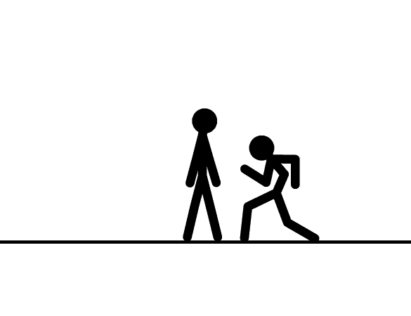
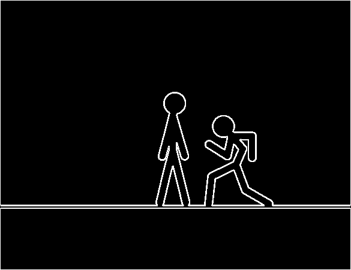
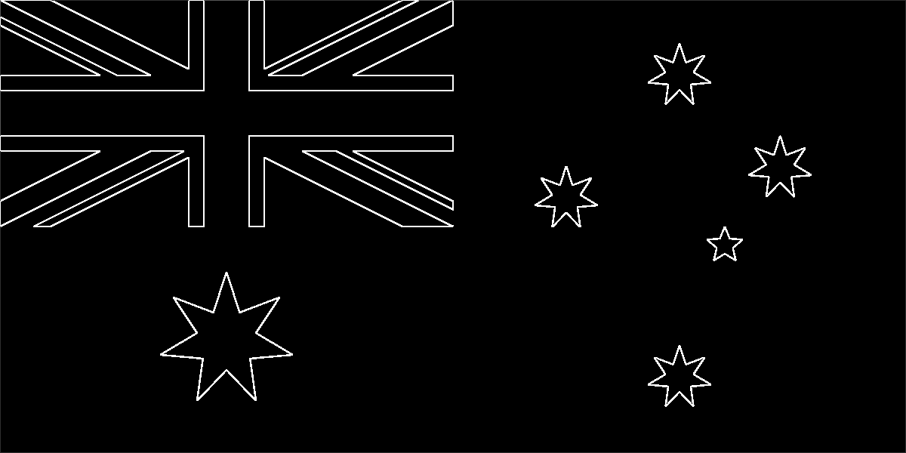
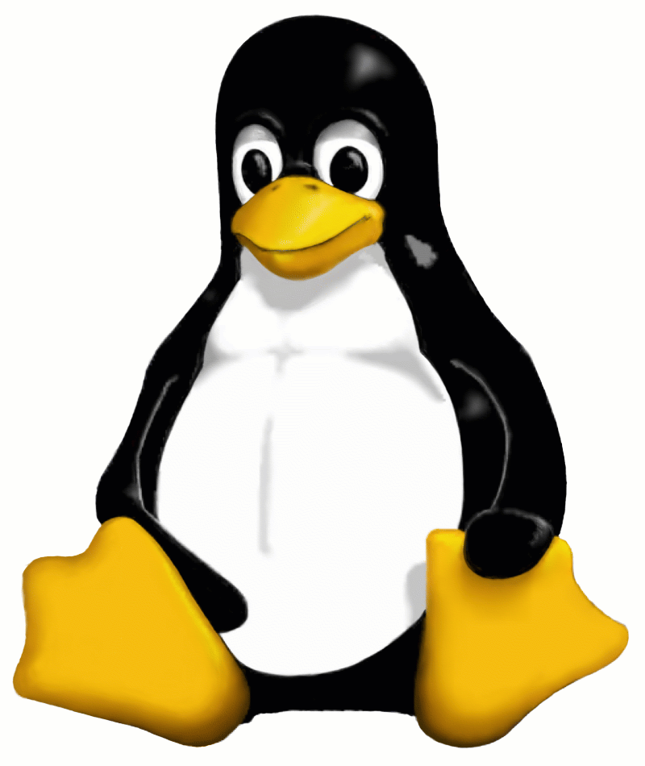
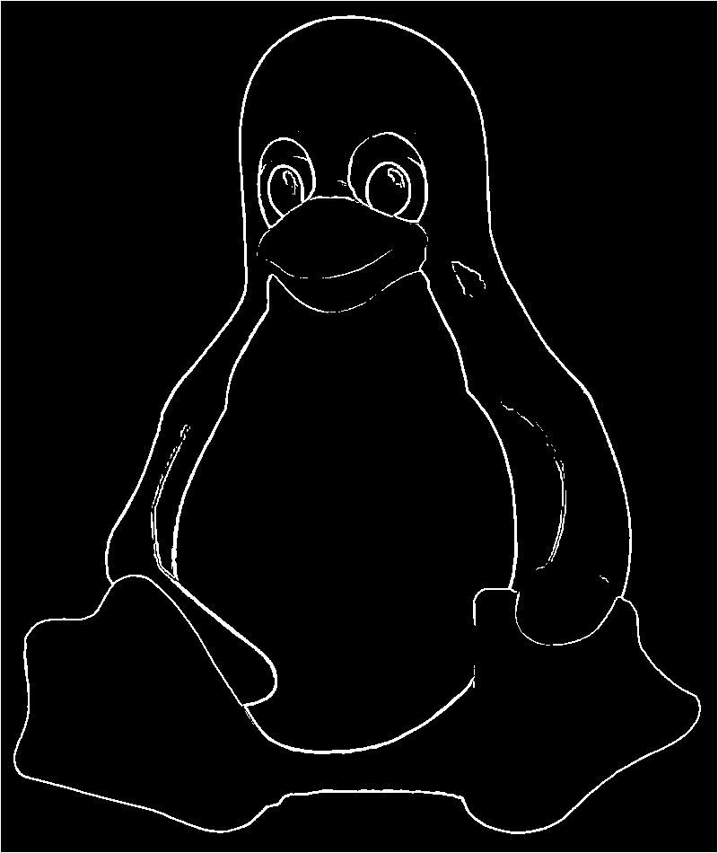
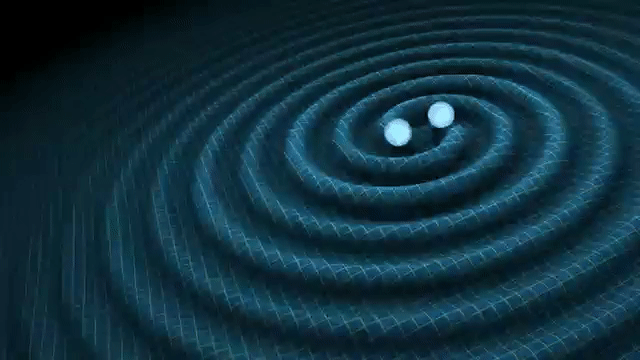
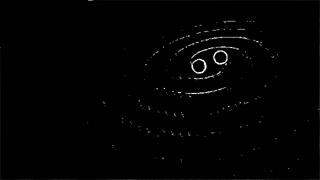

# Topic 1 - Image Filtering

This first topic covers a large spectrum of algorithms in HPC and Big Data. We focus here on image filtering which can be seen as a direct application of big data programs like the one performed by Google for image recognition (coupled with Deep Learning). Furthermore, this approach can be grouped in the domain of stencil application.

## Description

This topic focuses on a specific image filter that is useful to detect objects and edges inside various images. This filter is called Sobel and it applies on a grayscale image. Therefore, the first step is to transform the image from a color one to a set of gray pixels. For this purpose, we will work with GIF images because this format has the following advantages:

-   Easy to manipulate
-   Widespread format (social networks)
-   Allow animation (multiple images)
    Then, a blur filter is applied to a small part of the images to exclude the borders. Thus, the main goal of this project is to parallelize an application that apply multiple filters (grayscale, blur and Sobel) to a GIF image (either a single image or an animated GIF).

## Examples

This section presents some examples of Sobel-filter application on real images. The first image is very simple and shows how the filter can detect the edges by putting pixels in black if there are no differences with neighbors or in white if an edge is detected.

|                Before                |                      After                       |
| :----------------------------------: | :----------------------------------------------: |
|  |  |

This second image depicts a simple flag. After applying the Sobel filter, only the stars and the top-left corner contain white pixels.

|                            Before                            |                                  After                                   |
| :----------------------------------------------------------: | :----------------------------------------------------------------------: |
|  |  |

With a simple drawing and a white background, the Sobel filter is able to detect the edges as shown on the right-hand side of the following picture.
| Before | After |
| :----------------------------------: | :----------------------------------------------: |
|  |  |

Finally, this project supports animated GIF by processing and applying the Sobel filter frame by frame.

|                    Before                    |                          After                           |
| :------------------------------------------: | :------------------------------------------------------: |
|  |  |

## Source Code

The source code for this project is available here: sobelf.tgz. This archive contains:

-   <code>images/</code> : a set of images for testing the program
-   <code>include/</code> : a few header files
-   <code>src/</code> : the source code of the application. The file containing the filter to parallelize is main.c.
-   <code>obj/</code> : directory that will contain the object files to build the project (it will be created during the compilation phase if needed).
-   <code>Makefile</code> : type make to compile the code. It will create an executable binary named sobelf that takes 2 arguments: the input image file and an output image filename.
-   <code>run_test.sh</code> : This script launches the executable on the images located inside the images/ directory. The processed images are stored inside a subdirectory of images/.
-   <code>clean_test.sh</code> : This script removes the processed images from a subdirectory of images/

## Parallelism Hint

There are multiple levels of available parallelism: during the filter process (all filters!) of one image, while processing multiple images. The application already prints the time spend in image reading, processing and output.
